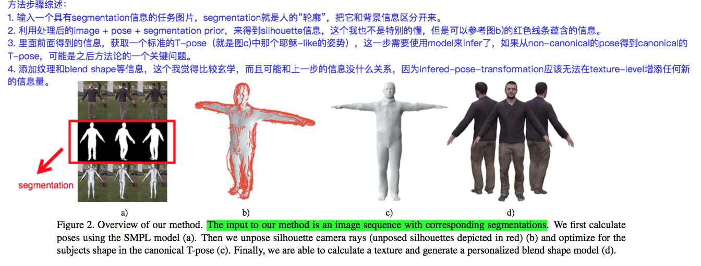

#  3D重建大作业第一次进度报告 (12/7-12/16)

小组成员：罗宇辰、胡雨奇、陈诺、冯二虎、曹金坤 

---

在组队完成后，我们小组的成员从零开始，开始上手本次大作业中涉及到的论文和代码等内容，截至12/16，我们小组目前已经进行的工作包括阅读理解第一篇论文、研究第一篇论文对应的源代码和数据集细节、阅读理解第二篇论文内容。

## 阅读理解第一篇论文

对于大作业中涉及到的第一篇论文"[Video Based Reconstruction of 3D People Models](http://arxiv.org/abs/1803.04758)"，我们小组尝试认真阅读和理解其中的内容，随本报告一同提交的附件中包含了第一篇论文的详细标注版本。尽管在第一篇论文中我们仍然有很多的不理解的技术细节，但是大概了解了论文的proposal和技术路线，具体来说，这篇论文提出了一种结合pose和shape信息来对video中截取到的，具有移动姿态的人体进行3D建模的方法。

### Motivation

作为论文的动机陈述，作者首先说明了之前用于这一技术的目标的若干方法和它们的不足：

* 使用高效的sanner采集建模数据：价格昂贵且尺寸巨大，难以被广泛使用；
* 使用多张静态人物姿态图片进行建模：为了得到良好结果，人物需要保持静止，非常困难；
* 使用RGBD相机图片进行建模：需要特别的传感器，没法从现成的视频材料中获取。

另一方面，这些方法在人物表面的纹理方面可以进行仿真，但是对于内部的骨骼姿态就难以进行准确仿真了：

> Further, all these methods merely reconstruct surface shape and texture, but no rigged animation skeleton inside.

因此，作者为了使用大量简单可获取的视频材料进行人物建模，定义这篇论文面向的技术目标为：

> In this work, we es-timate the shape of people in clothing from a single video in which the person moves.

即，允许对移动中的、无深度信息的、无双目数据的人物视频抽帧进行分析，对其中出现的人物进行具有表面衣着和纹理的、有内部骨骼形态估计的高效3D建模。

### Proposed Mechanism



针对前述的技术目标，作者提出了一种分步骤的技术框架，它的实现路径大概经过如下的步骤：

1. 基于成熟的SMPL框架[40]，首先对数据图片进行初步的形状和3D姿态预测，这一步将SMPL的结果和2D的关键点识别相结合。这一部分的工作和[7,37]中已经提供的方法十分相似。
2. 对于已经得到的基本轮廓和姿态框架，会对其添加细节的剪影信息(silhouette points)，这部分会表现为3D空间中的一些关键点。
3. 利用添加了细节silhouette信息的建模，为了之后的建模方便和减少计算的复杂性，会对得到的现有frame进行一个叫做unposing的操作，这一步骤会利用单目相机提供的ray projection信息，把原始姿态不同的人物轮廓统一成一个特定的姿态，比如论文中提到的T-pose（如上图b)和c)中所示）。
4. 针对前述步骤得到的结果，论文提出了一种优化的方法，对于3D空间中的关键点和形态参数进行优化。

### 优化方法

在对模型的优化上，因为数据是抽取自普通的视频，所以不存在3D建模可以参考的ground truth，为此论文中提出了一种特别的间接优化方法：

> Given the set of unposed rays for F silhouettes (we use F = 120 in all experiments), we formulate an optimization in the canonical frame

$$Formulation: E_{cons} = E_{data} + w_{lp}E_{lp} + w_{var}E_{var} + w_{sym}E_{sym}$$

这个优化的目标公式中有四个优化项，它们的加权形式提供了最终的模型训练优化目标。

#### Data Term

$$E_{data} = \sum_{(v,r)\in\mathcal{M}} \rho (v\times r_{n} - r_{m})$$

其中$$\rho$$是一个**Geman-McClure robust cost function**，而$$v$$是3D空间内关键点对应的矢量方向，$$r_{n}$$和$$r_m$$是对一个ray向量$$r$$进行**Plucker coordinates**分解之后得到的表示。

#### Laplacian Term

$$E_{lp}=\sum^{N}_{i=1} t_{l,i} || L_(v_i) - \theta_i||^2$$

该正则项目用来对之前建模出来的外形结构进行优化，使得基于mesh的建模表面更加的光滑。

#### Body Model Term

$$E_{var} = \sum^N_{i=1} t_{v,i} || v_i (\beta_0, \mathbf{B}) - v_{i} (\beta, 0)||^2$$

因为通过unposing的操作，我们会在3D建模结果的表面添加一些新的“顶点”（这里的“顶点”不仅表示突出的位置，也可能是凹陷的位置），为了纠正这种建模生成的顶点位置，我们希望它的位置可以和成熟的SMPL估计出的位置比较接近。具体的来说，在这个部分，作者添加了一个L2距离的惩罚项，简单地对两个不同的来源的对应估计点位置之间的偏移进行惩罚，从而期望得到比较准确的外表特征点位置的估计信息。

#### Symmetry Term

$$E_{sym} = \sum_{(i,j)\in\mathcal{S}} t_{s,i,j} || [-1,1,1]^T \mathbf{d}_i - \mathbf{d}_j || ^2$$

人体具有良好的中轴对称性，这个特征也可以用来修正一些产生了误差的关键点估计。具体来说，公式中的$$(i,j)$$是一对依照人的Y-axis对称分布的点对，它们依照Y-axis进行镜像对称后得到的点位置应该尽可能的靠近。依照我们的理解，尽管在真实的人物表面上，即使是依照人的身体中轴线对称的位置，它们在3D空间中的位置仍旧有可能有较大的偏差，这种偏差很大程度上是由人的不标准的姿态产生的。但是因为在进行到模型优化之间，前期的工作已经尝试把目标的frame规定成为了标准的T-pose/V-pose姿态，减少了这种因为pose的差异带来的对于人体表面信息对称性质的标淮，所以在没有ground truth的前提下，可以认为这种对称信息添加到模型的优化中是一种较为准确的prior信息，有利于生成标准姿态下的符合人体对称性质的3D建模结果。

### 纹理细节的生成

经过前述的工作，模型得到的也只是全局层面上的建模信息。而对于人的衣服、头发等细节信息带来的纹理等内容并没有办法给出，这也是因为之前的工作都是基于SMPL的，而SMPL并不能支持对于人的外着衣服等纹理的生成。对此，论文中提出了使用图片中的颜色信息和不同view下的可见点的位置相结合，来建立对于模型表面的纹理信息的推测，这一部分较为简练，具体的内容由下列内容说明：


## 上手第一篇论文的开源代码

对于第一篇论文，作者团队开源了他们的源代码：[videoavatars](https://github.com/thmoa/videoavatars)。因为需要基于第一篇论文的内容和代码来尝试研究和实现第二篇论文，所以我们也尝试上手研究了该开源代码项目。因为该代码项目高度依赖于[SMPL](http://smpl.is.tue.mpg.de/)项目，所以我们小组成员还首先尝试理解了SMPL的实现细节。

### SMPL实现细节

#### 概括：

 SMPL模型是一种参数化人体模型，是马普所提出的一种人体建模方法，该方法可以进行任意的人体建模和动画驱动。这种方法与传统的LBS的最大的不同在于其提出的人体姿态影像体表形貌的方法，这种方法可以模拟人的肌肉在肢体运动过程中的凸起和凹陷。因此可以避免人体在运动过程中的表面失真，可以精准的刻画人的肌肉拉伸以及收缩运动的形貌

#### 原理：

SMPL是使用`pose`和`shape`参数驱动的线性的人体模型，模型的主要参数有：`rest pose template`,`blend weights`,`pose-dependent blend shapes`,`identity-dependent blend shapes`,和一个从vertices到joint的`regressor`，这些参数都是是从训练数据中学习得来的。

SMPL的核心是shape形状参数，和pose动作参数到vertices和joint之间的映射的关系，即我们输入给定的shape和pose，通过模型可以得到相应的vertices和joint，通过vertices和joint我们就可以得到大致人体3D模型

SMPL的目标是创造一个可以表示不同形状的身体的，可以随着动作自然的变形的，并且软组织在运动过程中还能发生形变的 人体模型。SMPL其一采用了Blendshape方式，可以自然的从pose A 转换到pose B。比如我们现在有一个大笑的表情，和一个不笑的表情，我们可以通过blendshape方式将不笑逐渐过渡到大笑中。这样可以减少很多不必要的骨骼点；其二采用了骨骼蒙皮的技术，将顶点与关节关联起来，每个关节控制控制若干个不同的顶点，达到角色运动的效果。

#### 模型参数：

模型的输入参数pose 形状参数$$\beta$$和shape动作参数$$\theta$$，模型输出是每个点vertices的坐标量。在该模型中，vertices = 6890 joint=23，论文中给定了72个pose和10个shape。

* vertices：顶点，可以当成小三角形（四边形）组成，顶点越多模型就越精细。

* joint参数都由一个三元组作为参数去控制，即$$\vec{w}_k\in \mathbb{R}^3$$在SMPL中总共设置了23处关节。

* pose参数是使用axis-angle（轴角的意思是，我们可以会用一个旋转轴方向的单位矢量和一个转过的角度的标量来表示一个旋转量）来定义的，每一个joint有三个维度，所以需要3个pose进行控制。（SMPL中有23处关节加上原点总共24处，所以pose参量个数为24*3=72）

* shape参量为人体高矮胖瘦、头身比等比例的10个参数。

**SMPL模型公式**（具体见论文处）：

* **N**：表示vertices数量6890 **K**：表示关节的数量23

* $$\mathbf{\bar{T}} \in \mathbb{R}^{3N}$$：平均的模板形状 (mean template shape)， 这个时候的pose是zero pose,()

* $$\mathcal{W}\in \mathbb{R}^{N\times K}$$：各个关节的混合权重。（骨骼蒙皮）

* $$B_S(\vec{\beta}): \mathbb{R}^{|\vec{\beta}|} \rightarrow \mathbb{R}^{3N}$$：blend shape函数，将shape参数映射到每一个点上（pose A与pose B 的自然过渡）

* $$B_P(\vec{\theta}) : \mathbb{R}^{|\vec{\beta}|} \rightarrow \mathbb{R}^{3N}$$：将pose参数映射到每个点上

* $$J(\vec{\beta}): \mathbb{R}^{|\vec{\beta}|} \rightarrow \mathbb{R}^{3K}$$：将shape参数映射到每个joint的位置上

最终得到的结果就是, $$M(\vec{\beta}, \vec{\theta}; \alpha) : \mathbb{R}^{|\vec{\theta}|\times |\vec{\beta}|} \rightarrow \mathbb{R}^{3N}$$，将shape和pose参数映射到每个点上，每个节点在空间上有三个维度。

#### 应用扩展：

有别于其他的人体模型，SMPL可以进行人体骨骼蒙皮（Rig）和人体贴图。

- 骨骼蒙皮（Rig）：建立骨骼点和顶点的关联关系。每个骨骼点会关联许多顶点，并且每一个顶点权重不一样。通过这种关联关系，就可以通过控制骨骼点的旋转向量来控制整个人运动

- 纹理贴图：动画人体模型的表面纹理，即衣服裤子这些。（这部分感觉是论文中主要讨论,因为SMPL是生成裸体的人物模型，如何将还原人体表面的细节纹理是进一步的要求）

### Videoavatar源代码上手细节

#### 项目环境搭建

根据[videoavatars][1]中的指引配置即可，需要下载模型和数据集

#### Step1 - Pose Reconstruction

##### 1. 项目依赖的库

```python
# OpenCV - 有很多图像处理和计算机视觉有关的函数
import cv2 

# 命令行解析和数据存储
import h5py
import argparse
import cPickle as pkl

# 求导、微分、积分和矩阵操作
import numpy as np
import chumpy as ch

# openDR
from opendr.camera import ProjectPoints
from opendr.lighting import LambertianPointLight
from opendr.renderer import ColoredRenderer
from opendr.filters import gaussian_pyramid
```

##### 2. 项目依赖的预设文件或者参量

```python
# 1. 关节点文件，预先通过OpenPose框架处理获取得到，记录了人的18个关节点的位
args.keypoint_file,	
# 2. 论文中提到的 silhouette image ，是将每一帧中的人的形象截取进行二值化处理得到的图片
args.masks_file,
# 3. 相机标的文件
args.camera,
# 4. 工程输出内容的存储路径
args.out, 
# 5. 需要被refine的目标人体建模模型
args.model, 	
# 6. A-pose标准姿态参考文件
args.prior, 	
# 7. 用于生成canonical的pose时候的reshape
args.resize,	
# 8. 目标人体的身高记录，用于实现论文提到的标准化输出
args.body_height,
# 9. 一个边缘参量，标识在计算的时候是否考虑到手的长度，个人觉得这个变量的存在是因为openpose不提供手长
args.nohands,		 
```

Openpose产生的标准输出格式可以参考：[Openpose的输出格式](https://www.aiuai.cn/aifarm712.html)

##### 3. main函数

```Python
    def main(keypoint_file, masks_file, camera_file, out, model_file, prior_file, resize, body_height, nohands,display):
```

(1) 加载数据
把预处理好的各种pkl和h5py数据加载进来

```python
model_data = pkl.load(fp)
camera_data = pkl.load(fp)
prior_data = pkl.load(fp)
keypoints = h5py.File(keypoint_file, 'r')['keypoints']
masks = h5py.File(masks_file, 'r')['masks']
num_frames = masks.shape[0]
```

（2）初始化

```python
# 将基本模型数据加载到一个Smpl对象里面
base_smpl = Smpl(model_data)
base_smpl.trans[:] = np.array([0, 0, 3])
base_smpl.pose[0] = np.pi
base_smpl.pose[3:] = prior_data['mean']//我觉得这一步可能就是把pose预设成A-pose prior的pose，从而在一个比较合理的基础上进一步改进
# 调用openDR里面的各种函数，对投影等机制的条件进行初始化，标定相机
camera = ProjectPoints(...)
frustum = {...}
```

(3) 创建frame对象的工具函数

```python
# generic frame loading function
def create_frame(i, smpl, copy=True):
f = FrameData()
# ... 标定frame的初始参量
f.keypoints = np.array(keypoints[i]).reshape(-1, 3) * np.array([resize, resize, 1])
f.J = joints_coco(f.smpl)
f.J_proj = ProjectPoints(v=f.J, t=camera.t, rt=camera.rt, c=camera.c, f=camera.f, k=camera.k)
f.mask = 
f.collision_obj = collision_obj(f.smpl, regs)
f.pose_prior_obj = pose_prior_obj(f.smpl, prior_data)
f.pose_obj = (f.J_proj - f.keypoints[:, :2]) * f.keypoints[:, 2].reshape(-1, 1)
return f
```

（4）挑选5个帧的数据对模型进行一个预处理

```python
# 因为模块使用的图片是来自于视频的截取，而因为动作在时域上的延续性，所以就需要使用
# 若干个关键帧作为参考来进行分析，在初始化的时候使用第一帧作为基础
base_frame = create_frame(0, base_smpl, copy=False) 

# 从所有帧里面等距挑选出5个来，组成init_frames数组
num_init = 5
indices_init = np.ceil(np.arange(num_init) * num_frames * 1. / num_init).astype(np.int)

init_frames = [base_frame]
for i in indices_init[1:]:
    init_frames.append(create_frame(i, base_smpl))
    
# 使用这5帧来预处理    
init(init_frames, body_height, b2m, debug_rn)
```

（5）逐帧对模型进行refine

```python
# get pose frame by frame
with h5py.File(out, 'w') as fp:
    last_smpl = None
    poses_dset = ...
    trans_dset = ...
    betas_dset = ...
    for i in xrange(num_frames):
       # 以上是要写到out里的数据
       
# 每次循环都以前一帧的pose为基础，当object error过大的时候，就进行re-init
reinit_frame(current_frame, prior_data['mean'], nohands, debug_rn)

...

 # 核心的fit函数
fit_pose(current_frame, last_smpl, frustum, nohands, debug_rn)

...

# 存储每一帧相关的数据
poses_dset[i] = current_frame.smpl.pose.r
trans_dset[i] = current_frame.smpl.trans.r

if i == 0:
    betas_dset[:] = current_frame.smpl.betas.r
    last_smpl = current_frame.smpl
```

##### 4. init函数

```python
def init(
	frames,			# 用来当做init数据源的帧数组
	body_height, 	# 输入的身高数据，可能为空（None）
	b2m, 			# 这个是在main中从asset里直接读取的参数，被用在了身高预测里面，我不是很懂
	viz_rn 			# 从openDR里调用的coloredrenderer对象，在get_cb中被使用，我没有弄懂):
```

```python
# 从论文中来看，betas就是最后用于SMPL建模的shape参数，在函数中，貌似是通过对与betas有关的损失进行局部优化，
# 从而对pose那些的数据进行初步的调整，感觉类似于神经网络里面更新w让loss变小
betas = frames[0].smpl.betas
```

```python
# 按照论文中的说法，因为并非所有的人体目标都提供了标准的身高信息，所以可能需要进行高度预测
E_height = None
if body_height is not None:
     E_height = height_predictor(b2m, betas) - body_height * 1000.
```

（1） 首先单独为每一帧确定一个大概的pose

```Python
# first get a rough pose for all frames individually
for i, f in enumerate(frames):
    # 这里是对第0,2,5,8,11号关节的scores求和，scores是指这个关节定位的可信度，
    # 意思应该是要五个关节（头，左右肩，左右胯）可信度总分>3的时候，才处理
    if np.sum(f.keypoints[[0, 2, 5, 8, 11], 2]) > 3.:
        # 这里的【2,0】和【5,0】指的是左右肩的x坐标
        if f.keypoints[2, 0] > f.keypoints[5, 0]:#left & right shouder
            f.smpl.pose[0] = 0
            f.smpl.pose[2] = np.pi
```

该处是对产生于SMPL基本pose进行处理

```
base_smpl.pose[0] = np.pi
base_smpl.pose[3:] = prior_data['mean']
```

可以看到是pose[0]和pose[2]分别是pi和0，但是从smpl.py中看，pose整体是个shape（72）的数组，所以具体他的数据与他表示的pose怎么对应，还需要再理解一下，我们暂时不清楚

```Python
E_init = {'init_pose_{}'.format(i): f.pose_obj[[0, 2, 5, 8, 11]]}

x0 = [f.smpl.trans, f.smpl.pose[:3]]

if E_height is not None and i == 0:
    E_init['height'] = E_height
    E_init['betas'] = betas
    x0.append(betas)
    ch.minimize(
        E_init,
        x0,
        method='dogleg',
        options={'e_3': .01,},
        callback=get_cb(viz_rn, f)
    )
```

> 这里主要是要提一下ch.minimize函数，根据肖老师发的chumpy文档，minimize是个提供局部优化的函数，比如f(x,y),minimize(f,[x,y],method="xxx")就是通过求f关于x,y的偏导，然后使用method策略调整x,y使f最小。所以再看代码，这里就是调整x0中的f.smpl.trans, f.smpl.pose来使E_init最小，‘dogleg’策略似乎是在原数据上更新。

（2）使用不同权重再次优化

```python
# 通过init，对betas，pose和trans都进行了初步的优化
weights = zip([5., 4.5, 4.], [5., 4., 3.] )

# 相当于[(5.，5.，),(4.5，4.),(4.，3.)]
# 定义3组（w_prior, w_betas）权重

E_betas = betas - betas.r

for w_prior, w_betas in weights:
    x0 = [betas]
    E = {'betas': E_betas * w_betas,}
    ch.minimize(E,x0,method='dogleg',...)
```

##### 5.reinit 函数

```python
def reinit_frame( frame, null_pose, nohands, viz_rn):
    
# 先判断object_error是不是过大    
if (np.sum(frame.pose_obj.r ** 2) > 625 or np.sum(frame.pose_prior_obj.r ** 2) > 75)\
    and np.sum(frame.keypoints[[0, 2, 5, 8, 11], 2]) > 3.:
        # 和init的部分一样，进行初始化，略过
        ...
        # 第二步的优化是局部优化，用到的GMOf是来的robustifier文件，应该是属于作者他们自己进行的可信度优化；另外就是nohands的值影响了考不考虑手的关节点数据，这个之前提到过。
        E = {'pose': GMOf(frame.pose_obj, 100),'prior': frame.pose_prior_obj * 8.,}
        x0 = [frame.smpl.trans]
        ...
```

##### 6. fit_pose 函数

```python
def fit_pose(
frame, 
last_smpl, //上一帧优化后的模型，论文中提到，为了得到更好地连贯性，选择在上一帧的基础上进行进一步的优化
frustum, nohands, viz_rn):
    if nohands:
    	faces = faces_no_hands(frame.smpl.f)
	else:
    	faces = frame.smpl.f
    
    # 对观察到的剪影数据进行 distance transform
    dst_type = cv2.cv.CV_DIST_L2 if cv2.__version__[0] == '2' else cv2.DIST_L2
    dist_i = cv2.distanceTransform(np.uint8(frame.mask * 255), dst_type, 5) - 1
    dist_i[dist_i < 0] = 0
    dist_i[dist_i > 50] = 50
    dist_o = cv2.distanceTransform(255 - np.uint8(frame.mask * 255), dst_type, 5)
    dist_o[dist_o > 50] = 50
    
    # 读取基本模型的 silhouette image 
    rn_m = ColoredRenderer(camera=frame.camera, v=frame.smpl, f=faces, vc=np.ones_like(frame.smpl), frustum=frustum, bgcolor=0, num_channels=1)
```

余下的部分还进行了一些细节的处理。下方的‘mask’项就是论文中提到的 ‘a silhouette term’，即公式（4）；‘2dpose’应该就是指‘ state of the art 2D joint detections ’；‘Prior’应该是‘ a single-modal A-pose prior’；感觉也算对应上了论文

```python
E = {
    'mask': gaussian_pyramid(rn_m * dist_o * 100. + (1 - rn_m) * dist_i, n_levels=4, normalization='size') * 80.,
    '2dpose': GMOf(frame.pose_obj, 100),
    'prior': frame.pose_prior_obj * 4.,
    'sp': frame.collision_obj * 1e3,
}
```

使用上一帧的数据作参考，以保持连贯性

```python
if last_smpl is not None:
    E['last_pose'] = GMOf(frame.smpl.pose - last_smpl.pose, 0.05) * 50.
    E['last_trans'] = GMOf(frame.smpl.trans - last_smpl.trans, 0.05) * 50.
```

#### Step2 - consensu.py

##### 外部函数

需要留意的就是以下这几个函数，封装了一些具体的运算逻辑

```python
from lib.frame import setup_frame_rays
from lib.rays import ray_objective
from lib.geometry import laplacian
from lib.ch import sp_dot
from models.bodyparts import faces_no_hands, regularize_laplace, regularize_model, regularize_symmetry
```

##### main

```python
def main(
pose_file, masks_file, camera_file, out,
obj_out, 	# 这里.sh里面是设置成consensus.obj，就是生成一致性模型
model_file,nohands, naked, display,
num,first_frame, last_frame,	# 这里是规定了要用来作为数据来源的帧的数量、起点、终点
icp_count 	# ICP（Iterative Closest Point，迭代最近点）是一种迭代计算方法，可以简单理解为之后的优化迭代次数
):
```

（1）加载数据

这里回顾一下，trans是指变形，poses就是论文中的$$\theta$$，下面的$$\bata$$就是论文里的shape。可以看到程序中截取的是[first_frame:last_frame]区间值

```python
pose_data = h5py.File(pose_file, 'r')
poses = pose_data['pose'][first_frame:last_frame]
trans = pose_data['trans'][first_frame:last_frame]
masks = h5py.File(masks_file, 'r')['masks'][first_frame:last_frame]
num_frames = masks.shape[0]
indices_consensus = np.ceil(np.arange(num) * num_frames * 1. / num).astype(np.int)
```

（2）初始化   

```python
base_smpl = Smpl(model_data)
base_smpl.betas[:] = np.array(pose_data['betas'], dtype=np.float32)

camera = ProjectPoints(...)
camera_t = camera_data['camera_t']
camera_rt = camera_data['camera_rt']
frustum = {...}

# 关键函数为setup_frame_rays，这个函数是在frame.py中定义的，函数里面把pose和trans在相机坐标系下进行了转化
# 还将由剪影定义的rays存储在了frame对象中，以待之后的unpose

frames = []
for i in indices_consensus:
    log.info('Set up frame {}...'.format(i))
    mask = np.array(masks[i] * 255, dtype=np.uint8)
    pose_i = np.array(poses[i], dtype=np.float32)
    trans_i = np.array(trans[i], dtype=np.float32)
    frames.append(setup_frame_rays(base_smpl, camera, camera_t, camera_rt, pose_i, trans_i, mask))
```

（3）使用帧数组进行fit，构建一致性模型

```python
fit_consensus(frames, base_smpl, camera, frustum, model_data, nohands, icp_count, naked, display)
```

（4）导出consensus模型

```python
if obj_out is not None:
    base_smpl.pose[:] = 0
    vt = np.load('assets/basicModel_vt.npy')
    ft = np.load('assets/basicModel_ft.npy')
    mesh.write(obj_out, base_smpl.r, base_smpl.f, vt=vt, ft=ft)
```

#####  fit函数

这里的template就是原始模型，之后的各种正则项计算都会用到，主要是用来对比consensus模型和原始模型的某些参数属性

```python
model_template = Smpl(model_data)
model_template.betas[:] = base_smpl.betas.r
```

这几个参量来自bodypart.py，都是先令reg = np.ones(6890)，这里的6890对应于在unposing之后产生的3D背景下的关键点位置。然后设置其中某些项的数值，这些项对应人体的某些身体部分，最后返回这个reg数组，这个部分对应于在进行模型优化之间，对SMPL产生的结果进行标准化处理之后的统一形式。

首先，回顾一下优化过程中使用的优化公式：

$$E_{cons} = E_{data} + w_{lp}E_{lp} + w_{var}E_{var} + w_{sym}E_{sym}$$

```python
# 和论文中提到的一样，这里对应于模型优化过程中使用的三个损失项目
g_laplace = regularize_laplace()
g_model = regularize_model()
g_symmetry = regularize_symmetry()

...

E = {
    'laplace': (sp_dot(L, base_smpl.v_shaped_personal) - delta) * w_laplace,
    'model': (base_smpl.v_shaped_personal - model_template) * w_model,
    'symmetry': (base_smpl.v_personal + np.array([1, -1, -1])
                 * base_smpl.v_personal[model_data['vert_sym_idxs']]) * w_symmetry,
    }
```

接下来就是核心的fit循环，这里np.linspace是创建了一维等差数组，icp_count就定义了循环次数，从而定义了每次循环的参数变化步长，所以每次循环(w_laplace, w_model, w_symmetry, sigma)都会在对应的数值范围内有一定变化

```python
for step, (w_laplace, w_model, w_symmetry, sigma) in enumerate(zip(
        np.linspace(6.5, 4.0, icp_count) if naked else np.linspace(4.0, 2.0, icp_count),
        np.linspace(0.9, 0.6, icp_count) if naked else np.linspace(0.6, 0.3, icp_count),
        np.linspace(3.6, 1.8, icp_count),
        np.linspace(0.06, 0.003, icp_count),
)):
    L = laplacian(model_template.r, base_smpl.f)
    delta = L.dot(model_template.r)
    w_laplace *= g_laplace.reshape(-1, 1)
    w_model *= g_model.reshape(-1, 1)
    w_symmetry *= g_symmetry.reshape(-1, 1)
    
    # 遍历frames数组，对ray进行unposing，同时计算每一帧中的ρ(v × rn − rm) 。这些E['silh_{}']合起来就是Edata
    for current, f in enumerate(tqdm(frames)):
        E['silh_{}'.format(current)] = ray_objective(f, sigma, base_smpl, camera, vis_rn_b, vis_rn_m)
```

最后，按照线性组合的方法对模型进行总体的优化

```python
ch.minimize(
    E,
    [base_smpl.v_personal, model_template.betas],
    method='dogleg',
    options={'maxiter': 15, 'e_3': 0.001},
    callback=get_cb(frames[0], base_smpl, camera, frustum) if display else None
)
```

## 阅读理解第二篇论文

本次大作业的核心要求是在前述的第一篇论文的基础上尝试理解第二篇论文[Detailed human avatars from monocular video](https://arxiv.org/abs/1808.01338)并进行内容的重建。在本周的初次上手尝试中，我们还对第二篇论文的诸多细节缺乏足够的认识，但是我们可以总结第二篇论文的基本内容。


第一篇论文着重解决的问题是在单目相机摄制的视频基础上，对视频中出现的人物进行3D建模重建，而且不同于基础的SMPL模块，第一篇论文提出的方法还对衣服、头发等细节和人体表面纹理进行了重建，而且重建的目标人体并不需要是完全静态的。这些都大大扩展了3D重建的可用性。但是，第一篇论文的方法也存在诸多的不足，在同一研究组提出的第二篇论文中进行了总结：

> the reconstructions are overly smooth, lack facial details and the textures are blurry. This results in avatars that do not fully retain the identity of the real subjects.

对此，该篇论文在几个方面上提出了创新，以优化人体3D重建的细节：

* 添加了面部的锚点(Facial Landmarks)数据，帮助更准确的面部图像重建；
* 考虑到更复杂的光照环境和由此产生的阴影，作者提出了在基础的模型上进行"shape-from-shading"，从而获得不同局部区域的阴影效果重建；
* 基于简单的ray projection进行的表面纹理重现往往比较粗糙，而且因为表面的建模实际上基于离散化的平面mesh，这也就导致了表面的纹理的不细致，对此，作者在对纹理进行RGB赋值的同时，还尝试保留了空间的光滑性质，这也是本篇论文的重要贡献，作者提出了一个特别的*texture update energy function*来辅助进行表面纹理的缝合，并且把对计算资源和内存的使用控制在一个合理的范围；
* 基于表面纹理的实际意义，比如人的皮肤和衣服的分割，作者提出了一种"semantic texture sitiching"的方法来优化可能产生的texture spilling（不同的纹理或者表面区域互相交错的情况）的情况。