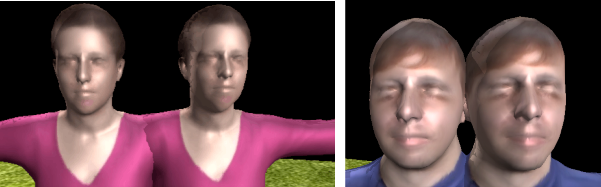
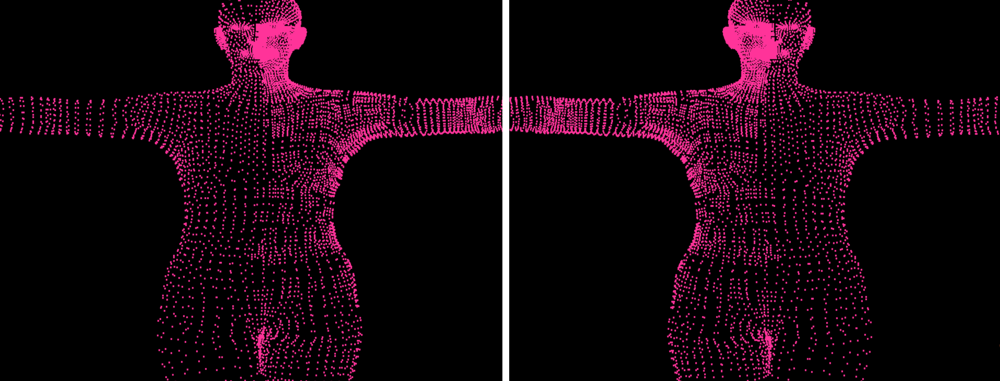

# Detailed Video Avatar

基于已有的3D人体建模框架，本项目完成的相关工作包括：

1. 部署运行[videoavatar](https://github.com/thmoa/videoavatars)工程，该项目是论文[“Video Based Reconstruction of 3D People Models”](http://arxiv.org/abs/1803.04758)的官方release版本，对视频素材中的人物进行3D重建；
2. 自行拍摄视频进行3D人体模型重建工作，并在基础输出的基础上进行细节的优化等工作；
3. 实现了论文["Detailed human avatars from monocular video"](https://arxiv.org/abs/1808.01338)(Detailed Avatars)中提出的部分技术创新(Mesh Subdivision和Medium-level shape reconstruction)，在videoavatar输出的基础上得到了更加精细的3D人体建模框架；
4. 将videavatar框架移植到了Python3.x的环境中，核心是移植了[chumpy](https://github.com/mattloper/chumpy)和[opendr](https://github.com/mattloper/opendr)两个依赖库；
5. 开发了一个易用的模型渲染和可视化工具，对videoavatar生成的模型文件和贴图文件进行结合，得到最终的有表面纹理贴图的动态建模效果。

# 文件组织

```shell
|-- Render: 便捷的模型纹理和贴图合成工具
|-- snapshot：基于自拍视频的3D人体建模工程
|-- docs						# 文档文件部分
	|-- final_report：结题答辩的相关文档材料
	|-- Notes：包括进度报告、学习笔记等项目进行中的文档材料
|-- code						# 代码文件部分
	|--	MLBSR: 实现了Detailed Avatars中的Medium-level Body-shape Reconstruction部分
	|-- SSBM: 实现了Detailed Avatars中的Subdivided SMPL model部分
	|-- Portable_py3.x：包含了opendr和chumpy的python3.x移植文件
	|-- videoavatar：原始的videoavatar工程文件	
```

# DEMO

## VideoAvatar


## 自拍视频建模


## 面部细节优化



## 模型mesh细化效果



---

> 小组成员：[曹金坤](https://github.com/noahcao)、[胡雨奇](https://github.com/ReimuYk)、[罗宇辰](https://github.com/592McAvoy)、[陈诺](https://github.com/199ChenNuo)、[冯二虎](https://github.com/fengerhu1)


