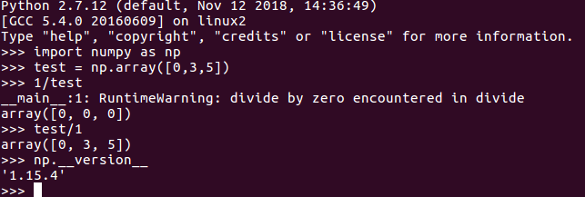
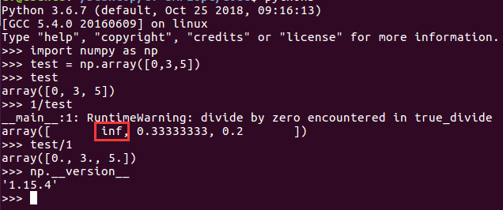
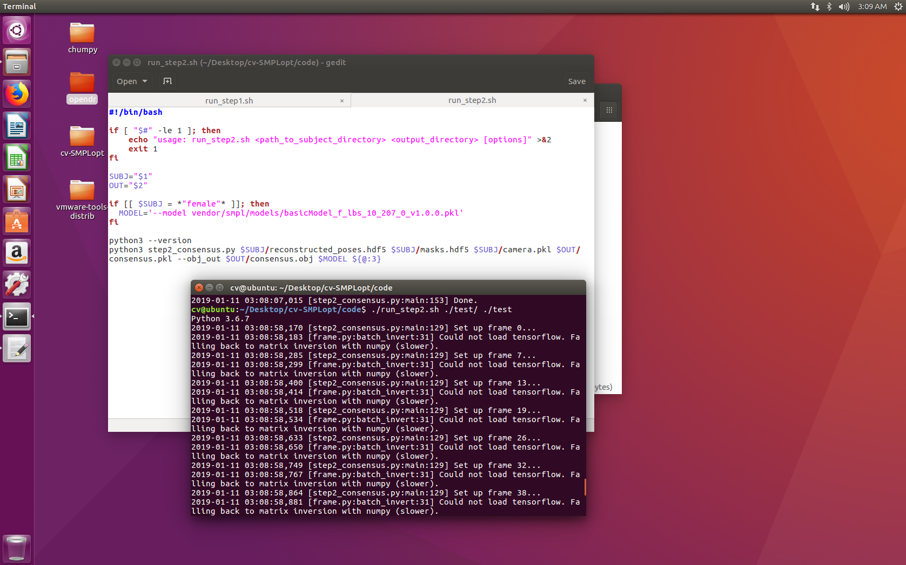
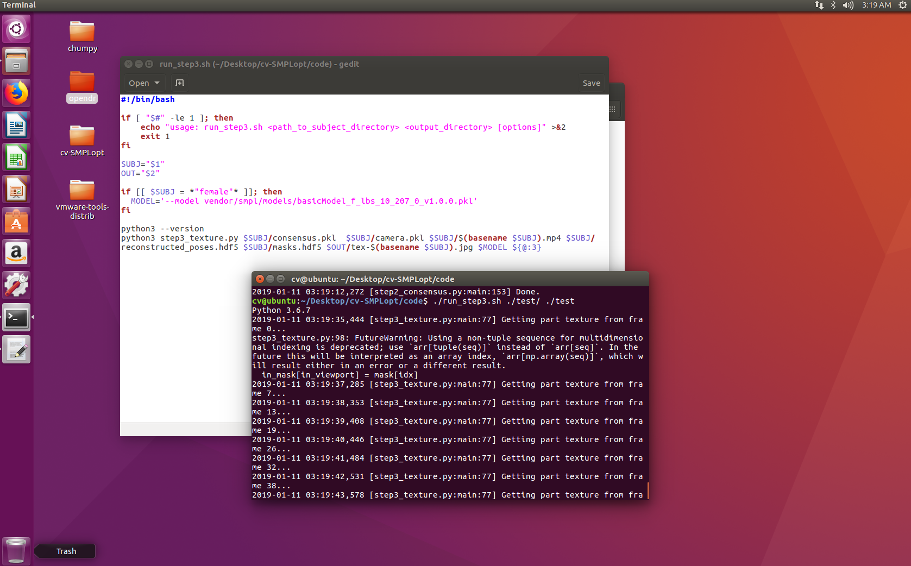

# 移植报告

## 一、移植目标
- 将工程中step1-3的代码在python3环境下运行无报错并输出正确结果

## 二、不兼容部分的修改方案
这里只简述移植过程中碰到的问题，书写报告时间和移植完成时间比较远，不保证完整性
### 1)内置函数
- print函数的调用形式
```
    print "helloworld" # python2
    print("helloworld") # python3
```
- reload函数不再作为内置函数，而被封装入imp
```python
    from imp import reload # add for python3
```
- reduce函数不再作为内置函数，被封装入functools
```python
    from functools import reduce # add for python3
```
### 2)关于import
- python2与3的“absolute import”语法不同，即在同目录下的import .py文件的语法不同。
```python
    # xxx.py 
    # 同目录下有utils.py
    # import utils # python2
    from . import utils #python3
```
- 同理，
```python
    # xxx.py
    # from t import * # python2
    from .t import * # python3
```
### 3)pickle
- python2与3中pickle的库名不同
```python
    # import cPickle as pkl # python2
    import pickle as pkl # python3
```
- 由python2储存的pkl文件在py3中打开需要选择编码形式
```python
    # pkl.load(fp)
    pkl.load(fp,encoding='latin1')
```
### 4)运算符“/”
- python2中的除法是整除法，类似c语言，而python3中的单斜杠除法表示浮点除法，运算结果将被直接转换成浮点数，即使是整除，这会和numpy产生很多联合错误（矩阵的除法）
```python
    # 将浮点型矩阵转换成整形矩阵（主要用于shape矩阵）
    # shape矩阵必须是整型矩阵(会报错)
    arr = arr.astype(np.int32)
    # 将浮点数转换成整数
    k = int(k)
```
- 关于“/”的运算符重载
```python
    # 重载“/”符号 in ch.py
    
    # python2 "/" ，需注释掉
    def __div__ (self, other): return ch_ops.divide(x1=self, x2=other)

    # python3 "/"
    def __truediv__ (self, other): return ch_ops.divide(x1=self, x2=other)
```
- 矩阵中的除零错(可能会引发错误，未修改)
    - python2<br>
        

    - python3<br>
        
### **5)关于opendr的ctx_mesa.so链接库的移植**
#### 前述
- 首先得了解一下cython，cython本质上是c和python语言的混合体，可以编译出让python直接import的动态链接库。
- ctx_mesa.so主要是简化opengl的模块并完成opendr和opengl的对接。
- python2与python3在cython中的基础数据类型不一样，直接import python2的连接库会报数据结构找不到的错误
    > undefined symbol: _Py_ZeroStruct
- 需要做的是，在python3环境下重新编译ctx_mesa；并且在不同的环境下，比如移植到mac下，需要重新进行编译
#### 编译步骤
1. 如果从别的地方拿到了适合的ctx_mesa.so，就不需要下面的步骤了
1. 收集编译素材并确认
    ```shell
    cv@ubuntu:~/Desktop/opendr/contexts$ tree -L 4
    .
    ├── autogen.py
    ├── _constants.py
    ├── ctx_base.pyx
    ├── ctx_mac_internal.c
    ├── ctx_mac_internal.h
    ├── ctx_mac.pyx
    ├── ctx_mesa.c
    ├── ctx_mesa.pyx
    ├── ctx_mesa.so(这个是最后的输出)
    ├── draw_triangle_shaders_2_1.py
    ├── draw_triangle_shaders_3_2.py
    ├── fix_warnings.py
    ├── _functions.pyx
    ├── gl_includes.h
    ├── __init__.py
    ├── Makefile
    ├── OSMesa
    │   ├── include
    │   │   └── GL
    │   │       ├── glext.h
    │   │       ├── gl.h
    │   │       ├── gl_mangle.h
    │   │       ├── glu.h
    │   │       ├── glu_mangle.h
    │   │       ├── glxext.h
    │   │       ├── glx.h
    │   │       ├── glx_mangle.h
    │   │       ├── osmesa.h
    │   │       ├── vms_x_fix.h
    │   │       ├── wglext.h
    │   │       └── wmesa.h
    │   └── lib
    │       ├── libGL.a
    │       ├── libGLU.a
    │       ├── libOSMesa.a
    │       └── pkgconfig
    │           ├── gl.pc
    │           ├── glu.pc
    │           └── osmesa.pc
    └── __pycache__

    6 directories, 34 files
    ```
1. 修改 setup.py，使之满足python3语法（附件中有修改好的版本）
1. 命令行执行安装指令（**使用python3**）
    ```shell
    $ python3 setup.py build_ext --inplace
    ```
1. 如果编译出ctx_mesa开头的.so文件，则说明正确，修改文件名为ctx_mesa.so替换即可，若出现额外报错，则修正后重新编译
#### 编译后与ctx_mesa.so的OsContext类对接
- 由于python2中str和bytes是同一个数据类型，可以直接传参对接，python3中需要先将str转换为bytes对象再传参
    ```python
    s = s.encode() # trans str to bytes
    ```
- 主要是在opendr库中的renderer.py中对接并修改
    ```python
    from opendr.contexts.ctx_mesa import OsContext
    ```
- opendr库中_constants.py定义了一些与opengl对接的常数，需要在合适的位置import(都在原始代码的注释中，取消注释即可)
    ```python
    from .contexts._constants import *
    ```
## 三、移植效果展示
### step2

### step3
**关于运行step3，一定要注意目录名称和mp4的名称相同，否则会生成黑色的空白纹理**




    