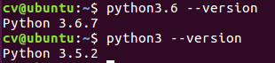

# 关于python3下代码的环境配置

该目录下的文件实现了Python3.x环境下的Videoavatar工程的移植。相关的细节可见随附的文档和代码。

## 测试用环境
- Ubuntu 16.04 LTS
- Python 3.6.7
- opencv-python 3.4.5(.20)

## 安装python3.6
这步不一定有必要，Ubuntu16.04 LTS自带python2和3，其中3的版本是3.5.2，可能和3.6有微小的差别，如果不安装，可以跳过此步<br/>

<br/>
```
  sudo add-apt-repository ppa:jonathonf/python-3.6
  sudo apt-get update
  sudo apt-get install python3.6
```
安装完后，python3的默认路径仍然指向原来的python3，需要重新链接一下<br/>

<br>
链接方法如下<br>


## 手动安装修改过的chumpy和opendr

1. 把chumpy和opendr文件夹复制进linux系统
1. 通过软连接或者直接复制的方式，将两个文件夹移动到如下位置
    > /usr/local/lib/python3.6/dist-packages/  

    
1. 进入python3，尝试import chumpy和opendr
    - import chumpy时会报依赖错误，缺少scipy，看到报错说明已经安装了chumpy
    - import opendr不应该出现错误

## 安装python3.6需要的依赖
1. 安装pip3
    > sudo apt-get install python3-pip
1. 安装python的各种依赖
    - scipy(会附赠numpy)
        > sudo python3 -m pip install scipy
    - opencv
        > sudo python3 -m pip install opencv-python==3.4.5.20
    - h5py
        > sudo python3 -m pip install h5py
    - matplotlib
        > sudo python3 -m pip install matplotlib
    - python3-tk
        > sudo apt-get install python3-tk
    - tqdm
        > sudo python3 -m pip install tqdm

## 测试
尝试运行脚本文件，根据报错进行修复，检查一下python3的版本之类的 