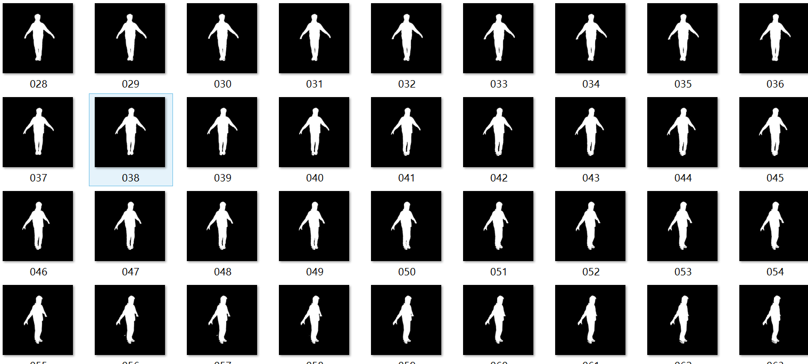

# 生成人物mask

### 摘要：

在制作模型的时候我们需要得到人物的mask和smpl模型的2d投影进行匹配。如何在图片中准确的找出人物的mask是该优化的关键。我们可以使用开源的deep mask框架，也可以通过CNN进行训练。我们在尝试了deep mask之后发现识别的精度并不好，对我们模型的优化有极大的影响。之后尝试了通过手动标注mask的方式，但是效果仍然不佳，所以使用了图像处理（边缘检测，二值处理，滤波，开闭操作）生成了较为精确地mask。

### mask生成原理及方法

+ 因为我们得到的图像是一个RGB的彩色图像，为了方便我们的处理，先将图像进行灰度处理。这里采用了加权平均法，对三个通道进行灰度的转换。

  ```python
  img = cv.CreateImage(cv.GetSize(image), image.depth, 1)
  for i in range(image.height):
      for j in range(image.width):
          img[i,j] = 0.3 * image[i,j][0] + 0.59 * image[i,j][1] +  0.11 * image[i,j][2]
  ```

+ 进行中值滤波，过滤噪声点，使最后生成的mask更加准确。这里我们使用的滤波窗口为5.

  ```python
  img = cv2.medianBlur(img,5)
  ```

+ 对图像进行开操作，填补上mask中的一些小洞，使的mask看上更加的准确。这里我们采用10*10的卷积核

  ```python
  kernel = cv2.getStructuringElement(cv2.MORPH_RECT, (10, 10))
  th1 = cv2.morphologyEx(th1, cv2.MORPH_OPEN, kernel, iterations=5)
  ```

+ 对图像进行边缘的检测，得到大致的轮廓。我们使用的'Adaptive Mean Thresholding', 'Adaptive Gaussian Thresholding'这两种边缘检测的方式对图像进行分析。虽然能够较为完整的识别出人物的轮廓，但是还存在很多我们并不需要的线条，所以只能用作生成mask的参考。

  ```python
  th2 = cv2.adaptiveThreshold(img,255,cv2.ADAPTIVE_THRESH_MEAN_C, cv2.THRESH_BINARY,11,2)
  th3 = cv2.adaptiveThreshold(img,255,cv2.ADAPTIVE_THRESH_GAUSSIAN_C, cv2.THRESH_BINARY,11,2)
  ```

+ 生成的mask是二值图像，所以最关键的是对选择好合适的阈值，由于对一幅图像选择统一的阈值并不靠谱，一种方式是我们采用自适应的阈值，即对不同的地方采用不同的阈值，另一种方式是手动进行划分，分块二值最后再合并

  自适应阈值：

  ```python
  th0 = cv2.adaptiveThreshold(img,255,cv2.ADAPTIVE_THRESH_MEAN_C,cv2.THRESH_BINARY_INV,13,15)
  ```

  我们采用了自相邻区域平均，高斯窗口为（13,15）因为背景模块颜色单一，人体模块颜色单一，所以导致了前景和背景中二值后都为0，但是在前景和背景的交界处，由于灰度梯度较大，所以既存在0也存在1，所以使用这种二值的方式，我们可以轻松的得到十分精确的人物的轮廓。这个是意外的发现。

  手动分割图片，分段二值：

  ```python
  for i in range(1080):
      for j in range(250):
          model[i, j] = 0
      for j in range(830, 1080):
          model[i, j] = 0
  model2 = np.ones((1080,1080))
  for i in range(100,350):
      for j in range(0,700):
          model2[i, j] = 0
  model3 = np.zeros((1080,1080))
  for i in range(100,350):
      for j in range(0,700):
          model3[i, j] = 1
   ret,th1 = cv2.threshold(img,67,255,cv2.THRESH_BINARY_INV)
   ret, th2 = cv2.threshold(img, 187, 255, cv2.THRESH_BINARY_INV)
   th1 = th1*model
   th2 = th2 * model
   th1 = th1*model2+ th2*model3
  ```

  分段二值后的结果非常好，可以作为最终的mask使用

图像处理效果及mask展示：

1. 图像处理效果：

   

2. mask效果展示：

   