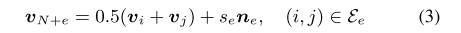
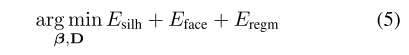
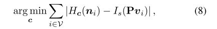

# 第二次进度报告(12/17-12/25)

小组成员：罗宇辰、胡雨奇、陈诺、冯二虎、曹金坤 

基于前一阶段的摸索学习，在刚刚过去的一周时间内，我们开展了许多新的工作，在此对本阶段的工作进度做简要报告。

## Section 1. 和Dr.Weipeng Xu交流


在12/24的下午，小组成员按照约定和**"Video Based Reconstruction of 3D People Models"**(paper1)以及**"Detailed human avatars from monocular video"**(paper2)两篇论文的参与者[Dr.Weipeng Xu](https://people.mpi-inf.mpg.de/~wxu/)进行了远程语音沟通，因为前期我们在代码和论文理解的许多方面都存在疑问，所以借此机会询问了相关问题。在沟通中，Dr.Xu对部分疑问作出了解答，包括：

* paper1中的模型优化目标$$\mathcal{D}$$的形式同样适用于paper2的方法实现，所以在实现paper2的过程中，对于模型最外层优化pipeline的实现可以直接基于paper1的开源代码进行；
* paper2的Section3.3中用shape from shading对于建模表面的诸多片块得到一个基本的base normals预测$$\tilde{N}$$，因为这个时候的结果是简单基于稳定的SMPL和少量的额外信息(shape-from-shading)得到的，所以可以被期望是较为准确的。在之后，因为可能会添加额外的shape deformation和texture等信息，可能会导致normals的偏移，这时候会以$$\tilde{N}$$为基准进行修正，这个部分体现在了论文的Eq.12中；
* 论文中使用的shape-from-shading方法来自于文献[84]，该文献的作业也为马普所人员，他们内部拥有原始代码。但因为[84]的代码并没有公开，所以我们并不能直接使用。对此Xu博士提出了两种方法：
  * 自己尝试实现[84]中的方法，但是他也提到这个论文的方法对参数比较敏感，自己实现的困难比较大；
  * 尝试使用其他的shape-from-shading方法作为替代，统一数据格式即可。
* 包括论文中的Eq.7和Eq.9在内，部分公式引入了若干的需要主观设置的超参数作为一个公式中多项之间的权重比，徐博士确认这些公式对于权重值的选择都是弱敏感的，只需要保证不同项目的数量级大概一致即可。对于Eq.4中的权重$$w_{ij}$$，它来自于一个经典的Laplace Matrix，相关知识徐博士推荐了论文["Laplacian Surface Editing"](https://igl.ethz.ch/projects/Laplacian-mesh-processing/Laplacian-mesh-editing/laplacian-mesh-editing.pdf)给我们，类似知识也体现在了公式Eq.10之中。
* 因为3D重建对于我们是一个比较新颖的领域，而这篇论文又比较复杂，实现难度比较大。对于3D重建的相关只是，徐博士建议如果我们有兴趣且时间充裕的话，可以先了解[VisualSFM](http://ccwu.me/vsfm/)和[MVE](https://github.com/simonfuhrmann/mve)等比较经典的论文。
* 对于Section 3.2中使用的[14]的方法，徐博士说，该模型必须在目标数据集的训练集部份上进行fine-tune，否则很难得到可用的结果，具体的方法是手动标注一个base frame的ground truth，之后迭代进行训练。

## Section 2. 精读论文

作为之后工作开展的基础，我们小组成员还继续精读了论文**“Detailed human avatars from monocular video”**，对其实现的基本步骤做了总结：

### 1. 细化SMPL模型

我们的方法是基于SMPL进行人体建模。然而，原始的SMPL模型过于粗糙，无法对服装皱纹和精细面部特征等细节进行建模。所以我们需要完善SMPL模型


这里的改善模型和第一篇论文中的相仿，都是通过增加一项offset项对每一个点进行微调

我们可以通过过M的逆函数将一个建立好的模型unpose成一个标准的T-pose函数

在第二篇论文中，我们为了细分每一条边，加入了一类新的顶点：



### 2. Medium-level body shape reconstruction

首先联系第一篇论文，通过预处理好的关键帧的数据，我们可以通过2D画面预估出3D的姿势，然后再unpose成为标准地T-pose，之后基于阴影，对称性等损失量，对模型的shape进行优化，但是该过程对人脸的细节处理不够精准。所以作者提出了一个新的形体估计的公式：



这里和第一篇论文中有点类似，将面部的三维模型的二维投影和在关键帧中的二维信息进行匹配，损失量为顶点到ray之间的距离。

### 3. Modeling fine-level surface details

通过剪影我们可以获得中的粒度的细节，但是无法获得更加精细的表面特征，所以这里作者采用了 shape-from-shading.

- **shape-from-shading**

  对于每一针我们通过CNN分解方法，将图像分解成为反射比和留下的阴影。函数HC计算模型中顶点C留下的阴影。我们需要将模拟得到的阴影和观察得到的阴影相差最小。

  

  p是投影矩阵用于计算观察得到的阴影，Hc能够计算模型中顶点留下的阴影。

  之后加入了两个惩罚下，一个是拉普拉斯光滑项，另一个是顶点到阴影距离的梯度项

- **Surface reconstruction**

  这里我们还是使用step1，step2中的方法，对面部先进行unpose，然后在我们优化面部曲面使其更加自然，加入轮廓项，face项，shape-from-shading项，regf项{match：相邻关键帧差异的惩罚项（ warp-field），lap:光滑项，struc：通过改变边的长度保持mesh}等等。最后我们要做到使等式（11）尽可能的小。

### 4. Texture generation

- **Partial texture generation:** 

  这一步其实就非常简单，就是将我们可见的颜色映射到相应的纹理中去。

- **The semantic prior**

  我们将输入帧的每一个像素贴上语义的标签（这里总共给出了10个语义标签）然后我们将每一帧的语义信息融合到全局的语义map中使代价最小，具体可见等式16,17。公式16输入的label和该frame中实际的label一样则返回给定值，其余情况则返回0；公式17，为了实现代价最小，这里模拟了图上色的问题，每一个标签分配一种颜色？

- **Texture merging**

  通过纹理k中t的颜色值之间的Mahalanobis距离表示这两个纹理之间的结构差异。我们保证了相邻纹理分配给相似的颜色，所以最后我们只要保证不同区域颜色的梯度值最小，即分配最为合理。

## Section 3. 研究SMPL框架

### 部分关键步骤说明

##### Blend Skinning：

骨架空间变形方法，也称为混合剥皮法。将网格的表面附加到底层骨骼结构上。受邻近关节点的影响，网格曲面中的每个顶点都使用加权变换。smpl的核心公式一组映射从R的（3N * 3K *theta *W）----->  R的（3N）空间中，我们，其中 rest pose：T（3N）； joint locations： J（3K）； a pose：θ； blend weights：W。为了精细化模型，我们加上了shape blend shape项和pose blend shape项，即将rest pose细分为三项，T-pose标准姿势下各个顶点的坐标， shape blend shape offset项，pose blend shape offset项。W是blend weight 为了方便计算我们假设每个vertices只和4个关节点旋转有关。

##### Shape blend shapes：

通过线性的方程Bs来表示不同人的body shape。是一个从shape到vertices 的映射，具体的那内容可以参照smpl论文中的（8）。Bs = β*s。β是个关于的形状的参数。s是经过训练出来的针对每一个shape的vertices的位移量，大小是（3N * |β|）

##### Pose blend shapes：

与Shape blend shape不同的是Bp不是一个线性的公式，而是一个跟cos和sin有关的公式，大致的操作是用当前的旋转矩阵和rest pose的旋转矩阵之差乘以个pose blend shapes矩阵P。旋转矩阵（9*23 = 207）；pose blend shape矩阵（3N * 9K）。P是通过训练得到的。

##### Rodrigues formula：

罗德里格旋转公式是将一个向量按照旋转轴旋转一定的角度之后得到的新的向量，可以通过矩阵表示。爱smpl的论文中，通过改变换可以得到joint的旋转方向

##### Training：

smpl对两类数据集进行了训练，使对这两个dataset的重建的误差降到最小，这两个数据集分别是muti-pose和muti-shape包含了男性和女性。muti-pose的数据集主要展现的是人的不同的动作姿势；muti-shape主要展现的是人不同的形状，比如人的高低胖瘦。

这里的优化方法也是优化不同的能量项

优化参数的规模：

* pose blend shapes：P（9K*3N）

* shape blend shapes：S（3N * 3K）

  以上两项乘以相应的参数矩阵均可以得到规模是（3N）的vertices offset的矩阵

* joint regressor ：J（3N * 3K）这项乘上vertices矩阵可以得到每个joint的坐标。

* skinning weights： W（4 * 3N）

* data term：是注册得到的顶点和我们模型得到的顶点之差。

* left-right asymmetry：这个惩罚项可以保证joint和mesh是对称。（计算 J 和 T 和其镜像之间的差值）

* be close to this initial prediction：我们对模型划分成了24个区域，我们将每个关键点初始化成为每个区域的中心，我们希望模型中的关节点和初始化中的关节点的位置相差尽可能小。

以上步骤我们可以通过shape和pose得到估计的mesh的空间位置，但是仅仅知道mesh不够的，我们还需要通过mesh回归得到joint的位置信息，这里我们采取Joint regressor的方法。即我们可以通过几个稀疏的mesh对joint进行线性的关联，起到给每个joint定位的作用。

### smpl数据结构及代码分析：

##### 参量的表示：

* `v_personal`：和v_template相同规模，是每个顶点的offse

* `v_template`：顶点模板。所有的优化都是在这个基础上进行的

* `J`：关节坐标

* `weight`：混合权重（关节点-顶点）

* `kintree_table`：关节树

* `f`:face由三个顶点构成

* `bs_type`：蒙皮方法LBS还是DQBS

* `posedirs`：pose的字典对应论文中的pose blend shapes

* `shapedir`: shape的字典对应论文中的shape blend shapes

* `trans`：平移量

* `pose`：定义了pose的参数，关节个数*3（转轴方向，旋转角度）

* `beta`：定义shape的参数

* `J_regressor`：joint的回归矩阵，用于给joint定位

##### 部分数据结构细节

字典项和对应的数据类型

未修改的SMPL模型，6890个点，13776个face

| 字典项             | 数据类型     | 备注                                                     |
| ------------------ | ------------ | -------------------------------------------------------- |
| J_regressor_prior  | (24,6890)    |                                                          |
| f                  | (13776,3)    | face，就是每个三角形，[i0,i1,i2]其中i是点的序号（0~6889) |
| J_regressor        | (24,6890)    |                                                          |
| kintree_table      | (2,24)       | kinematic tree                                           |
| J                  | (24,3)       |                                                          |
| weights_prior      | (6890,24)    |                                                          |
| weights            | (6890,24)    |                                                          |
| vert_sym_idxs      | (6890)       | 点的序号（0~6889）不是顺序的                             |
| posedirs           | (6890,3,207) |                                                          |
| pose_training_info | {一个字典}   |                                                          |
| bs_style           | string       | "lbs"                                                    |
| bs_type            | string       | "lrotmin"                                                |
| v_template         | (6890,3)     | 模型的局部空间坐标                                       |
| shapedirs          | (6890,3,10)  | 10shapes                                                 |

### magic numbers

- 6890: SMPL模型中顶点的数量

- 13776: SMPL中face的数量，face就是mesh的一个面，论文中的应用都是三角形，所以字典中"f"项中每个元素都是三个顶点的下标，表示三角形的三个顶点

- 24: SMPL将模型分为了24个部分，可以保留实现

- 23: 24个部分拼接需要23个拼合处，可以保留实现

- 10:10个shape，实现不需要修改

- 207: 23*9 pose blend shape（参见SMPL论文），我们的实现应该不关心这个数字

- 110210: 论文2中提出优化后的顶点数量。

- 原始SMPL模型中有6890个点和13776个面，每个面有三条边，每两个面共享一个边，因而SMPL中边（edge）的数量为

  >  num(e) =  13776*3/2 = 20664

- 细化后SMPL模型中多出的边数量为

- > num(e_add) = 110210-6890 = 103320

- 均分到每个face上的点增量为

  > num(e_add_per_face) = 103320/13776 = 7.5

  这里7.5就是两次细化后（论文2 Figure3）中，中心的3个加上边上的9个（9/2=4.5）

- 每个face被分成16个部分，所以产生了总共220416个小的face部分

  > 220416 = 13776 * 16

##### 代码分析：

在给的代码中，model文件夹下有smpl.py模块

在SMPL主模块中，给了两个参数`terms = 'model'`表示我们要读取的smpl的路径

`dterms = 'trans', 'betas', 'pose', 'v_personal'`对应论文一种公式（3），tran：表示基本的模板，beta：表示shape，pose：即pose，v_personal：表示我们的优化项D

对`tran`、`beta`、`pose`进行初始化：

```python
if not hasattr(self, 'trans'):
    self.trans = ch.zeros(3)
#trans是三维坐标中的位移量
if not hasattr(self, 'betas'):
    self.betas = ch.zeros(10)
#beta是shape的参数，总共有十个数据
if not hasattr(self, 'pose'):
    self.pose = ch.zeros(72)
#pose姿势的参量跟关节点的个数有关
```

接下来的代码是将序列化的模型（保存在pkl中）还原成为smpl模型，具体每个参数的意思可以见之前的参数列表。

```python
def joints_coco(smpl):
    J = smpl.J_transformed
    nose = smpl[VERT_NOSE]
    ear_l = smpl[VERT_EAR_L]
    ear_r = smpl[VERT_EAR_R]
    eye_l = smpl[VERT_EYE_L]
    eye_r = smpl[VERT_EYE_R]

    shoulders_m = ch.sum(J[[14, 13]], axis=0) / 2.
    neck = J[12] - 0.55 * (J[12] - shoulders_m)

    return ch.vstack((
        nose,
        neck,
        2.1 * (J[14] - shoulders_m) + neck,
        J[[19, 21]],
        2.1 * (J[13] - shoulders_m) + neck,
        J[[18, 20]],
        J[2] + 0.38 * (J[2] - J[1]),
        J[[5, 8]],
        J[1] + 0.38 * (J[1] - J[2]),
        J[[4, 7]],
        eye_r,
        eye_l,
        ear_r,
        ear_l,
    ))
```

因为smpl的joint数量多于coco数据集中的，所以这里选取一部分的joint用于和coco数据集中的joint进行比较。

```python
self.v_shaped = self.shapedirs.dot(self.betas) + self.v_template
```

每个shape参数点乘训练好的shape blend shapes矩阵，再加上每个顶点的模板信息，得到每个vertices的空间坐标。

```python
self.v_shaped_personal = self.v_shaped + self.v_personal
```

加入自定义的offset

```python
self.J = ch.sum(self.J_regressor.T.reshape(-1, 1, 24) * self.v_shaped.reshape(-1, 3, 1), axis=0).T
```

通过joint的回归矩阵，得到每个joint的空间坐标

```python
self.v_posevariation = self.posedirs.dot(posemap(self.bs_type)(self.pose))
```

pose参量按照给定的蒙皮的方式点乘训练好的pose blend shapes矩阵，得到每个vertices的offset

```python
self.v_poseshaped = self.v_shaped_personal + self.v_posevariation
```

结合了shape from shapes 和pose from shapes之后的每个vertices的空间坐标

## Section 4. OpenDR

### 1. Inverse graphics

*Inverse graphics* 是指**逆图像化**，与**图像化**是一个相反的过程。“图像化”是通过一些参数（几何信息、光照、材质，etc）来**渲染**（*render*）得到图像。“逆图像化”就是指从sensor data（图片、视频、体感数据，etc）中推测得到几何信息、光照信息等参数。   
这两个过程相结合，就可以从sensor data中提取信息，然后产生模型数据来仿真和拟合真实情景。

### 2. Renderer

Renderer是指**渲染器**，负责处理图像化的过程，即利用参数来生成图片/模型

### 3. Differentiable Renderer

OpenDR是一个开源框架，DR指**Differentiable Renderer（可微的渲染器）**，也就是说，它具有这样的功能：    
（1）能通过给定的参数来**渲染**图像   
（2）能自动对这些参数进行**求导**，从而进行**局部优化**   
OpenDR是基于OpenGL、OpenCV和Chumpy（提供auto differentiation）搭建的

### 简介

OpenDR的**前向渲染过程**可以简单理解成一个函数$f(\Theta)$，其中$\Theta$ 就是渲染用到的参数的集合。而最简单的**优化过程**也就是使rendered image intensities和observed image intensities之间的difference最小。这个difference可能是由各种复杂的函数定义的，但是核心思想都是要让合成的图像和实际的图像之间区别最小

### 前向过程-渲染

前面已经提到渲染函数$f(\Theta)$，这里将$\Theta$总的分解为三个参数：**V**（vertex locations），**C**（ camera parameters ）和 **A**（per-vertex brightness ）。即$\Theta = {V, C, A}$    

forward model主要进行以下几个近似：

#### 1. Appearance（A）：

> Per-pixel surface appearance is modeled as **product of mipmapped texture and per-vertex brightness**, such that brightness combines the effects of reflectance and lighting. 
> 每个像素的值都是纹理数据和每点的光照乘积，所以像素的亮度就反映了反射项和光照项的共同作用。

关键词：texture；per-vertex brightness；

#### 2. Geometry （V）

> We assume a 3D scene to be approximated by triangles, parameterized by vertices V , with the option of a background image (or depth image for the depth renderer) to be placed behind the geometry
> 3D信息是通过点组成的三角面片表示的，背景图像、深度图像可以作为几何信息的附加信息。

关键词：vertices；background image；depth image；

#### 3. Camera (C) 

> We approximate continuous pixel intensities by their sampled central value.
> 使用连续像素的采样中心值来近似像素的强度。相机投影模型是来自OpenCV的 pinhole-plus-distortion camera projection model。

总的来说，openDR的渲染过程与其他的图像管线（graphics pipelines）大体是相同的。关键的区别在于，其他pipeline支持的是per-pixel的渲染函数，而openDR支持的是**per-vertex**的渲染函数

### 对前向过程进行微分

#### Part1 ：Differentiating Appearance

> Pixels projected by geometry are colored by the product of texture T and appearance A; therefore ∂f ∂A can be quickly found by rendering the texture-mapped geometry with per-vertex colors set to 1.0, and weighting the contribution of surrounding vertices by rendered barycentric coordinates. 

由于几何投影的像素是通过texture T和appearance A乘积来进行着色的，所以通过将与纹理对应的点的颜色设为1.0，并通过对周围点的重心坐标进行加权，就可以得到$\delta f/\delta A$  

> Partials ∂A ∂V may be zero (if only ambient color is required), may be assigned to built-in spherical harmonics or point light sources, or may be defined directly by the user.

$\delta A/\delta V$与设置的光照有关，如果只有环境光就是0  

#### Part2 ：Differentiating Projection

由于image的值是通过2D投影来与3D坐标和相机参数产生联系的，换言之，f通过U与C和V产生联系，所以有：
$$ \frac{\delta f}{\delta V} = \frac{\delta f}{\delta U}\frac{\delta U}{\delta V},\frac{\delta f}{\delta C} = \frac{\delta f}{\delta U}\frac{\delta U}{\delta C}$$
其中$\delta U/\delta V$和$\delta U/\delta C$都是OpenCV直接提供的

#### Part3 ：Differentiating Intensity with Respect to  2D Image Coordinates

这里篇幅比较长，而且都是一些具体做法。大致是这样的过程：（1）将所有的像素点分区：遮挡边界像素点和内部像素点（2）在此基础上将每个像素划分为三类：interior, interior/boundary, 和 many-boundary 中的一类，使用不同的filter进行处理

### 需要利用openDR做的工作

1.区分出3D facial landmarks    
2.构造3D facial landmarks的project rays    
3.建立2D facial landmark和相关rays的static map    

## Section 5. Medium-level body shape reconstruction

### 第一篇论文对应此部分内容  

1. segmentation  
   通过一个CNN网络，将（K=120帧）关键帧的前景和背景分开
2. 2D landmarks -> 3D pose  
   基于2D landmarks来恢复3D的pose。  
   方法是使用SMPL的逆函数，将约束锥（轮廓图的光线）转换成SMPL的标准T-pose

### 第二篇论文对应部分

为了得到更精细的面部细节，第一篇论文中计算能量的等式被修改为了等式（5） (加了面部能量项)  
Esilh + Eface +Eregm 
等式（5）的 Esilh和Eregm在第一篇论文中已经讨论过，这里着重讲[Eface](#e-face)。

1. <span id="map">面部landmark和mesh点的映射</span>

```
landmark <---barycentric interpolation(重心插值)---> mesh->points
```

每个landmark *l* 通过与邻近顶点的[重心插值](#gravity)被映射到表面。  
在[优化Eface项](#e-face)里，landmark是一个点，所以猜测这里的重心插值就是根据很多个点和这些点的比重，来计算目标点（也就是landmark）的位置 

1. <span id="openpose">使用openpose得到的关键点：</span>  

```
"people":[
    {
        "people":[x0, y0, score0, x1, y1, score1, ...],
        "face_keypoints":[x0, y0, score0, x1, y1, score1, ...],
        "hand_left_keypoints":[x0, y0, score0, x1, y1, score1, ...],
        "hand_right_keypoints":[x0, y0, score0, x1, y1, score1, ...],
    }
]
```

这里只讨论"face_keypoints"  
得到的数据中，共有70个面部关键点（每个关键点有三个值:(x, y, score)，按顺序排列）  
这些关键点对应位置如下：

  

1. <span id="e-face">Eface的计算</span>  
   Eface是对**2D脸部关键点** 与 **3D脸部关键点的2D投影**之间的距离的惩罚。  
   2D关键点来自于openpose的关键点检测（即上面的2.）  
   3D关键点的来源论文中没有提到，使用目前没弄清楚，希望在看过SMPL相关文件后能清楚    

2. 测量模型上的landmark: $\vec{l}$，和对应的camera ray: $\vec{r}$之间的点线距离  
   点线距离： 

   $$ \delta(\vec{l}, \vec{r}) = \vec{l} x \vec{r_n} - \vec{r_m} $$

   这里的$\vec{r}$是在unpose空间中，用来描述2D landmark的ray，并且由[普朗克坐标(Pluker Coordinate)](#pluker)来描述：  

   $$ \vec{r} = (\vec{r_n}, \vec{r_m}) $$

   其中，$\vec{r_n}$是**r**的方向向量，$\vec{r_m}$是力矩，具体定义见[普朗克坐标](#pluker)  

3. 计算Eface  

   $$E_face = \sum_{\vec{l}, \vec{r} \in L} \omega_l \rho ( \delta (\vec{l_l}, \vec{r_r})) $$

   其中，  
   $L$定义了landmark和mesh中点的[映射](#map)  
   $\omega$是CNN网络给出的landmark的可信度（这里的可信度，就是openpose识别出的关键点(x, y, score)的score项）  
   $\rho$是[Geman-McClure robust cost function](#geman)  
   为了加快计算过程，3.2使用的是粗糙的SMPL模型（来自于第二篇论文中，等式(1)的定义）  

### 一些名词

1. <span id="gravity">重心插值</span>  
   可以用类比cv课上颜色/灰度插值算法的内容来理解。  
   举一个最简单的一维坐标例子，有两个点`p1(x1)`和`p2(x2)`，  
   那么给定权重w，点P可以表示为：  

   $$P(w) = w*x1 + (1-w)x2$$

2. <span id="pluker">普朗克坐标 Pluker Coordinates</span>  
   普朗克坐标是用来表示线的一种方法,可以快速的判断两条3D空间内的线是否重合，快速计算他们之间的距离  
   普朗克坐标定义方法：  
   给定线 $l$上任意两点P0(x0, y0, z0)和P1(x1, y1, z1)，计算该线段的方向向量 $\vec{d}$ 和原点到这两个点的向量的叉乘结果 $\vec{m}$   
   普朗克坐标：
   $ \vec{l}=(\vec{d} ; \vec{m}) $

    $$(\vec{d}, \vec{m}) = (\vec{p0} - \vec{p1}, \vec{p0} x \vec{p1}) = ((x0-x1, y0-y1, z0-z1), (x0, y0, z0)x(x1, y1, z1))$$

   其中:  
   ​   $$x$$: 叉乘cross product  
   ​    第一个向量规定了线的方向向量，第二个向量又被称为“力矩。

3. Geman-McClure函数</span>  
   错误函数: $ \rho (x) = \frac{1}{2} \frac{x^2}{x^2 + \sigma^2 } $  
   其中$\sigma$是一个协调参数

## Section 6. Laplacian Smoothness

在论文的Eq.4、Eq.10和Eq.15等处，均提到了拉普拉斯平滑、拉普拉斯余切加权等操作，因为这部分的知识对于我们小组的成员非常陌生，所以我们也调研了相关内容并且记录了部分知识点。

### 摘要：

拉普拉斯网格优化与平滑是网格处理的经典算法，其一些基本概念可以作为神经网络预测3D mesh的一些约束，如平滑。

### 图的表示：

我们用 G=(V,E) G = ( V , E ) 来表示一个网格，其中V表示顶点由（x,y,z）三个坐标组成；E表示边由两个顶点组成。

### 拉普拉斯优化：

拉普拉斯优化的本质根据邻结点对每个顶点的位置进行优化，保证曲面看上去更加的光滑。每个邻结点都会对该目标点的位置做出一部分的贡献，贡献的大小由权重乘上到目标点空间距离组成。在拉普拉斯优化中权重可以	取均匀权重或者余切权重下面会进行具体的介绍。

拉普拉斯坐标定义为： 


其中 ∑{i,j}∈E  ∑wi,j=1 并且 


分别是均匀权值和余切权重。α,β为： 


**[论文]**在论文中我们为了给模型精细化，我们增加model的vertices数量，每一个新增的vertice是相邻的vertices的中点上，并且能够在法线方向上进行微调。论文中公式（3）s表示沿着法线方向的微小位移，优化的对象便是s。为了计算方便我们可以计算全局的拉普拉斯坐标值。（包括了model中原有的固定的vertices）。

上面的等式可以用矩阵表示： 


其中L是n×n的拉普拉斯矩阵： 


**[论文]**我们可以预先计算出一个Wi,j的权重的矩阵，权重矩阵大小（N*N），如果我们选择平均矩阵，即如果存在邻边权重设置为1/（目标度数），不相邻的权重为0。输入是N个vertices的三维坐标V（3 * N）。最终的结果是拉普拉斯坐标 = Vj（3*N） * Wj,i（N * N）- Vi（3 * N）（参考拉普拉斯坐标定义，第一个公式）。得到的结果是N个顶点的拉普拉斯坐标。拉普拉斯坐标与原点越近，则越平滑。（优化对象是可移动点的沿法向的位移s）

**拉普拉斯网格平滑求解：** 


$$L_u$$ 表示利用均匀权值构建的拉普拉斯矩阵，V_d^' V_d^' 为要求解的平滑后的网格顶点。其中用了m个顶点作为约束。这样等式左边是一个（n+m）×n的矩阵乘以一个n×1的向量（x,y,z分开算），右边是一个（n+m）×1的向量。

**拉普拉斯网格优化求解：** 


与平滑不一样的是，等式右边向量的前n个元素不再为0，而是在余切权值下计算得来的拉普拉斯坐标。

## Section 7. 对上次进度报告中代码学习的补充

在上次提交的进度报告中，我们小组成员总结了对于论文"Video Based Reconstruction of 3D People Models Thiemo"的开源代码的学习总结，因为时间缘故，我们只着重总结了论文中的Step1和Step2的代码细节。在那之后，我们继续研究其开源代码，对Step3的纹理处理部分的代码进行了学习，总结了部分的笔记。

#### 第一篇论文的Step3: Texture Generation

这一步，修改了等式7（能量项），使得能够连续得处理帧。  
每一步的初始化是上一帧，并且根据临近的帧来做regularize。  
为了生成纹理，他们将模型变形，然后将图片的颜色反投影到可见的vertice上，  
最后计算在所有view（我理解为各关键帧的观测）中，最正交的纹素的中值。  
将这些纹素merge到一起就得到了最终的texture

1. 入口函数  

```python
if __name__ == '__main__':
    parser = add_argument(
        # 输入各种参数
    )

    main(
        args.consensus, # 包含consensus的pkl文件，根据.sh文件看，应该就是第二步输出的consensus.pkl
        args.camera, # 包含camera设置的pkl文件
        args.video, # video文件
        args.pose_file, # 包含pose的文件
        args.mask_file, # 包含segmentation的文件
        args.out, # 输出文件位置
        args.model, # SMPL模型文件
        # 这个resolution在下面也经常被用到，也许是有多少片纹素？或者说是多少个被特殊标记的身体的某个位置
        args.resolution, # 输出的resolution， 默认为1000
        args.num, # 使用的关键帧数量，默认120（对应论文里面的K）
        args.first_frame, # 关键帧起点，默认0
        args.last_fram, # 关键帧终点，默认2000
        args.display # 是否做可视化处理
        )
```

```python
############## main函数 ###########    
    # 首先从文件中导入数据(model, camera, consensus)
    with open(model_file, 'rb') as fp:
        model_data = pkl.load(fp)

    with open(camera_file, 'rb') as fp:
        camera_data = pkl.load(fp)

    with open(consensus_file, 'rb') as fp:
        consensus_data = pkl.load(fp)

    pose_data = h5py.File(pose_file, 'r')
    poses = pose_data['pose'][first_frame:last_frame]
    trans = pose_data['trans'][first_frame:last_frame]
    masks = h5py.File(masks_file, 'r')['masks'][first_frame:last_frame]
    num_frames = masks.shape[0]
    indices_texture = np.ceil(np.arange(num) * num_frames * 1. / num).astype(np.int)

    vt = np.load('assets/basicModel_vt.npy')
    ft = np.load('assets/basicModel_ft.npy')
```

```python
    # 然后进行初始化
    base_smpl = Smpl(model_data)
    base_smpl.betas[:] = consensus_data['betas']
    base_smpl.v_personal[:] = consensus_data['v_personal']

    bgcolor = np.array([1., 0.2, 1.])
    iso = Isomapper(vt, ft, base_smpl.f, resolution, bgcolor=bgcolor)
    iso_vis = IsoColoredRenderer(vt, ft, base_smpl.f, resolution)
    camera = ProjectPoints(t=camera_data['camera_t'], rt=camera_data['camera_rt'], c=camera_data['camera_c'],
                           f=camera_data['camera_f'], k=camera_data['camera_k'], v=base_smpl)
    frustum = {'near': 0.1, 'far': 1000., 'width': int(camera_data['width']), 'height': int(camera_data['height'])}
    rn_vis = ColoredRenderer(f=base_smpl.f, frustum=frustum, camera=camera, num_channels=1)

    # 打开视频文件
    cap = cv2.VideoCapture(video_file)
    for _ in range(first_frame):
        # 获得下一帧
        cap.grab()
```

```python
    # get part-textures
    i = first_frame
    # tex_agg应该是包含所有纹素的列表
    tex_agg = np.zeros((resolution, resolution, 25, 3))
    tex_agg[:] = np.nan
    # normal_agg从字面意思来理解的话，估计是包含所有法向量的列表？
    normal_agg = np.ones((resolution, resolution, 25)) * 0.2

    vn = VertNormals(f=base_smpl.f, v=base_smpl)
    static_indices = np.indices((resolution, resolution))
```

```python
    while cap.isOpened() and i < indices_texture[-1]:
        if i in indices_texture:
            log.info('Getting part texture from frame {}...'.format(i))
            # grab下一帧并且返回，这里的'_'应该只是一个表示read()是否成功的布尔值， frame就是下一帧
            _, frame = cap.read()

            mask = np.array(masks[i], dtype=np.uint8)
            pose_i = np.array(poses[i], dtype=np.float32)
            trans_i = np.array(trans[i], dtype=np.float32)

            base_smpl.pose[:] = pose_i
            base_smpl.trans[:] = trans_i

            # (源码中自带的注释）which faces have been seen and are projected into the silhouette?
            # 我的理解是，这里只考虑会被看到的面，对应论文中讲到的，把color of image反投影到**可见**的vertice上
            visibility = rn_vis.visibility_image.ravel()
            visible = np.nonzero(visibility != 4294967295)[0]

            # 这一段没怎么看懂
            proj = camera.r
            in_viewport = np.logical_and(
                np.logical_and(np.round(camera.r[:, 0]) >= 0, np.round(camera.r[:, 0]) < frustum['width']),
                np.logical_and(np.round(camera.r[:, 1]) >= 0, np.round(camera.r[:, 1]) < frustum['height']),
            )
            in_mask = np.zeros(camera.shape[0], dtype=np.bool)
            idx = np.round(proj[in_viewport][:, [1, 0]].T).astype(np.int).tolist()
            in_mask[in_viewport] = mask[idx]

            faces_in_mask = np.where(np.min(in_mask[base_smpl.f], axis=1))[0]
            visible_faces = np.intersect1d(faces_in_mask, visibility[visible])

            # get the current unwrap
            # 用iso.render()处理了一下当前帧、可见的面
            part_tex = iso.render(frame / 255., camera, visible_faces)

            # angle under which the texels have been seen
            points = np.hstack((proj, np.ones((proj.shape[0], 1))))
            points3d = camera.unproject_points(points)
            points3d /= np.linalg.norm(points3d, axis=1).reshape(-1, 1)
            alpha = np.sum(points3d * -vn.r, axis=1).reshape(-1, 1)
            alpha[alpha < 0] = 0
            iso_normals = iso_vis.render(alpha)[:, :, 0]
            iso_normals[np.all(part_tex == bgcolor, axis=2)] = 0

            # texels to consider
            # 这里是意思是，找到需要处理的纹素？这一步和上一步（一个纹素在哪些角度下能被看到）有关
            part_mask = np.zeros((resolution, resolution))
            min_normal = np.min(normal_agg, axis=2)
            part_mask[iso_normals > min_normal] = 1.

            # update best seen texels
            # 我的理解是，把这个纹素更新到这一步得到的，最优情况
            where = np.argmax(np.atleast_3d(iso_normals) - normal_agg, axis=2)
            idx = np.dstack((static_indices[0], static_indices[1], where))[part_mask == 1]
            tex_agg[list(idx[:, 0]), list(idx[:, 1]), list(idx[:, 2])] = part_tex[part_mask == 1]
            normal_agg[list(idx[:, 0]), list(idx[:, 1]), list(idx[:, 2])] = iso_normals[part_mask == 1]

            if display:
                im.show(part_tex, id='part_tex', waittime=1)

        else:
            cap.grab()

        i += 1
```

```python
    # merge textures
    log.info('Computing median texture...')
    # 这里应该是寻找，“最正交的纹素的中值”
    tex_median = np.nanmedian(tex_agg, axis=2)

    log.info('Inpainting unseen areas...')
    where = np.max(normal_agg, axis=2) > 0.2

    tex_mask = iso.iso_mask
    mask_final = np.float32(where)

    kernel_size = np.int(resolution * 0.02)
    kernel = np.ones((kernel_size, kernel_size), np.uint8)
    inpaint_area = cv2.dilate(tex_mask, kernel) - mask_final

    tex_final = cv2.inpaint(np.uint8(tex_median * 255), np.uint8(inpaint_area * 255), 3, cv2.INPAINT_TELEA)

    cv2.imwrite(out, tex_final)
    log.info('Done.')
```

#### 需要特别注意的地方  

1. 第一篇：  

   1. 代码中出现的 face 应该是指面（与点相对应），而不是脸（与手像对应）  
   2. global transformation到底是什么
   3. 在paper1中 选取F=120个关键帧来进行迭代。在paper2中的shape-from-shading, 改为了K=60  
   4. nohands为真时会少考虑4个关节点（对应：20-23号关节点，分别是左右手腕和手）  
      这样会影响faces, rn_m的计算（rn_m是'silhouette image of the rendered model'）  
      相应的代码：

   ```python
   # 下面这段代码在fit_pose()中
   
   # 得到faces
   if nohands:
       faces = faces_no_hands(frame.smpl.f)
   else:
       faces = frame.smpl.f
   ...
   # 计算rn_m
   rn_m = ColoredRenderer(camera=frame.camera, v=frame.smpl, f=faces, vc=np.ones_like(frame.smpl), frustum=frustum,
                          bgcolor=0, num_channels=1)
   ...
   E = {
       'mask': gaussian_pyramid(rn_m * dist_o * 100. + (1 - rn_m) * dist_i, n_levels=4, normalization='size') * 80.,
       '2dpose': GMOf(frame.pose_obj, 100),
       'prior': frame.pose_prior_obj * 4.,
       'sp': frame.collision_obj * 1e3,
   }
   ```

   各关节：

   ```python
   self.j_names = {  
       0: 'Pelvis',  
       1: 'L_Hip',  2: 'R_Hip',   
       3:  'Spine1',  
       4: 'L_Knee',  5:  'R_Knee',   
       6:  'Spine2',    
       7:  'L_Ankle', 8:  'R_Ankle',    
       9:  'Spine3',  10: 'L_Foot',   
       11: 'R_Foot',    
       12: 'Neck',    
       13: 'L_Collar',  14: 'R_Collar',    
       15: 'Head',   
       16: 'L_Shoulder', 17: 'R_Shoulder',    
       18: 'L_Elbow',  19: 'R_Elbow',   
       20: 'L_Wrist',  21: 'R_Wrist',           
       22: 'L_Hand',  23: 'R_Hand',   
   }  
   ```

2. 代码与论文中的对应关系  

   1. Eq.4：

   ```python
   'mask': gaussian_pyramid(rn_m * dist_o * 100. + (1 - rn_m) * dist_i, n_levels=4, normalization='size') * 80.,
   ```

   1. SMPL的offset： $$\mathcal{D}$$  

   ```python
   v_personal
   ```

   这个变量也是整个工程的最终优化目标变量，出现在论文的Eq.3中：

   

   它使用了基本的SMPL原始代码接口，并针对论文中提出的改进做了外部的内容修改和优化。


