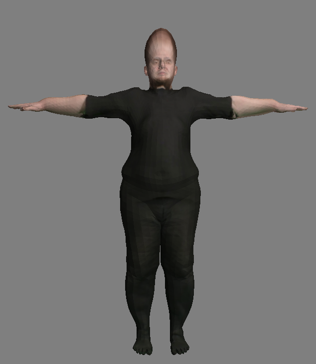
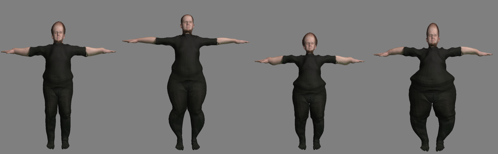
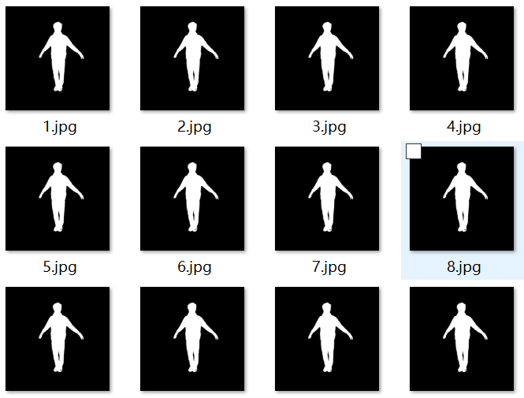
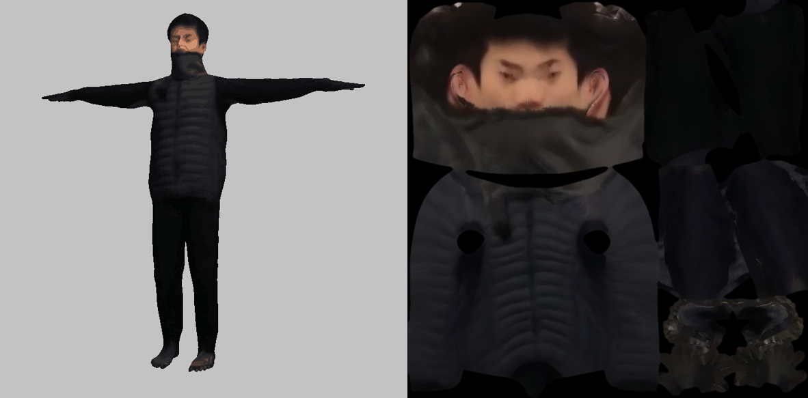

# 根据高清视频建模 - 实验报告

## 数据准备

使用/prepare_data目录下的几个python文件生成了建模数据：

```
camera.pkl # 相机

face_landmark.hdf5 # 面部关节点

keypoints.hdf5	# 人体关节点

masks.hdf5	# 剪影
```

## 实验过程

### 第一次实验

结果：失败



<center>第一次实验中得到的模型，纹理贴图来自原始数据集</center>

问题：在第一次实验中，我们遇到了很多问题：

1. step1中，从第2帧开始，fit_pose优化开始发散，引起后续的每一帧都触发reinit_frame，最终导致pose reconstruction过程失效
2. step2中，剪影光线和SMPL模型无法流畅拟合，模型形状要么与base model无异，要么出现过度变形
3. step3中，由于视频命名（没有与文件夹命名一直）和格式（原视频是.avi格式，要求是.mp4格式）的问题没有成功读取视频画面，生成的纹理全为黑色，无法用于渲染贴图

### Debug历程

#### （1）调整相机参数

考虑到step1的参数有关输入为mask，keypoint和camera，其中前两者都来自可靠的预处理结果，而camera的参数需要手动设置，且包含`焦距（Focal length）`,`畸变系数（Distortion coefficients）`，`视点（Principal point）`等多项参数，因此我们首先尝试了调整相机参数



<center>不同形状的失败模型</center>

实验过程中发现，相机的焦距$f_x$和$f_y$会影响mask投影点的大小，f越大，生成的 silhouette cone越大；相机的视点c会影响mask的位置

我们尝试了多种参数，建立了十几个失败模型，还是无法得到好的拟合效果，本次尝试失败

#### （2）调整能量项权重

$$
E_{cons} = E_{data} + w_{lp}E_{lp} + w_{var}E_{var} + w_{sym}E_{sym}
$$

由于优化过程基于上述公式，我们猜测，关于base模型的相似度惩罚$E_var$可能偏大，导致根据mask拟合的优化效果不明显，因此我们尝试将$w_{var}$在原始基础上缩小了4倍，但是也得到没有正面效果

本次尝试失败

#### （3）探查mask匹配问题

由于step1中从第2帧开始出现优化发散情况，我们考虑是否第三帧数据出现了问题

检查每一帧对应的mask图片:


检查发现，对应第三帧的图片并不是原始标号中的第3张图片，而是第101张，因此与之前的mask剪影不连续。由于剪影的突变，导致模型优化失败，优化发散，从而导致整个实验的失败

本次尝试成功，发现bug为mask文件

### 第二次实验

#### （1）修正错误

探究/prepare_data的mask2hdf5.py发现

```python
（mask2hdf5.py）

out_file = args.target
mask_dir = args.src
mask_files = sorted(glob(os.path.join(mask_dir, '*.png')) + glob(os.path.join(mask_dir, '*.jpg')))

with h5py.File(out_file, 'w') as f:
    dset = None

    for i, silh_file in enumerate(tqdm(mask_files)):
        silh = cv2.imread(silh_file, cv2.IMREAD_GRAYSCALE)

        if dset is None:
            dset = f.create_dataset("masks", (len(mask_files), silh.shape[0], silh.shape[1]), 'b', chunks=True, compression="lzf")

        _, silh = cv2.threshold(silh, 100, 255, cv2.THRESH_BINARY)
        dset[i] = silh.astype(np.bool)
```


在这个将图片信息转化存储的过程中，首先对图片按帧数进行了排序

```python
mask_files = sorted(glob(os.path.join(mask_dir, '*.png')) + glob(os.path.join(mask_dir, '*.jpg')))
```

检查发现，由于对mask的命名是1开始递增：



sort得到的结果就是：

```
1.jpg 10.jpg 100.jpg 101.jpg ...
```

必须将命名改为

```
001.jpg 002.jpg 003.jpg ...
```

才能得到正确的排序结果

#### （2）实验结果

得到正确的mask.hdf5文件后，我们重新进行了整个优化过程，成功得到了纹理图像和拟合度较好的模型：



<center>consensus模型  & texture贴图</center>

本次实验成功

### 进一步优化

我们尝试将第二篇论文中面部优化的实现在实验模型上进行效果测试，采用包含$E_{face}$的fit_consensus方法重新进行了step2和step3的实验

实验结果如下：


<center>面部优化后的consensus模型及面部细节</center>


<center>优化前（左）  &  优化后（右）</center>

可以看到明显的效果，面部优化后模型和纹理的匹配效果也更好了，五官的大小比例也更贴合真实形象

优化实验成功